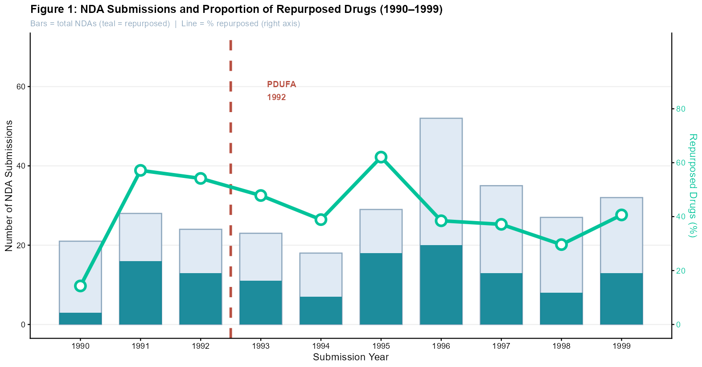
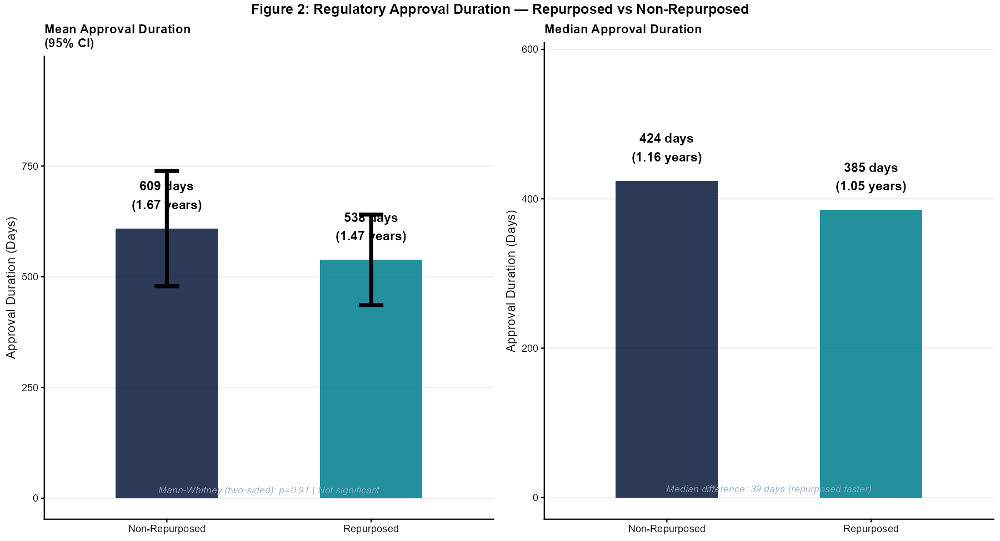
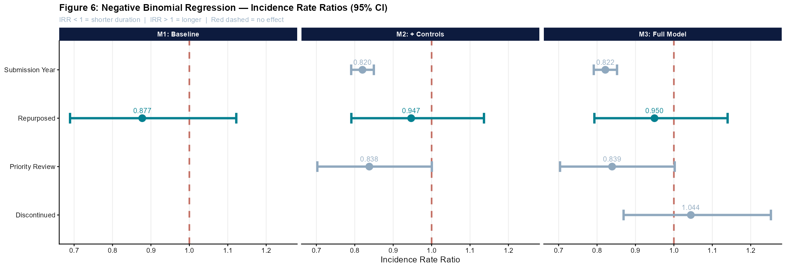

# Does Drug Repurposing Lead to Faster FDA Approval?

**Evidence from New Drug Applications, 1990–1999**

MSc thesis in Innovation & Industrial Management, University of Gothenburg (Spring 2026)
Author: **Aritra S. Utsha** · Supervisor: Dr. Bastian Marius Rake

📄 [Read the full thesis (PDF)](thesis/Masters_thesis_Final.pdf)

---

## Research question

Drug repurposing (finding new uses for existing compounds) is often promoted as a faster and cheaper route than developing new drugs from scratch. A testable implication: if repurposed drugs really are faster, it should show up in **regulatory approval times**. This project tests that directly using FDA data.

## Data

- **Source:** FDA [Drugs@FDA](https://www.fda.gov/drugs/drug-approvals-and-databases/drugsfda-data-files) database (public)
- **Sample:** 289 Type 1 new molecular entity NDA submissions, 1990–1999; **148** with complete approval-duration records
- **Outcome:** days from submission to approval, extracted from original FDA approval letters
- **Key variable:** repurposed (1) vs. non-repurposed (0), coded manually from evidence of later approval for a new therapeutic indication
- **Controls:** review priority, submission year, marketing status

## Methods

- Descriptive statistics and Spearman correlations
- Bivariate tests: Mann-Whitney U, chi-squared, Fisher's exact test
- **Primary model:** negative binomial regression (the outcome is an overdispersed count of days)
- **Robustness check:** OLS on log(duration) with HC3 robust standard errors
- Subgroup analysis by review type, post-PDUFA period and marketing status

## Key findings

| | Repurposed | Non-repurposed |
|---|---|---|
| Mean approval time | 538 days | 609 days |
| Median approval time | 385 days | 424 days |

1. **Repurposed drugs were approved 71 days faster on average, but the difference is not statistically significant** (Mann-Whitney two-sided p = 0.91).
2. **After controls, the repurposing effect nearly disappears:** IRR 0.877 in the baseline model → 0.950 in the full model, not significant in any specification.
3. **The dominant driver is institutional:** each later submission year is associated with roughly **18% shorter** approval time (IRR 0.82, p < 0.001), consistent with the effect of the **Prescription Drug User Fee Act (PDUFA) of 1992**.

**Takeaway:** any time savings from repurposing do not clearly show up at the regulatory stage in this sample; efficiency gains more likely occur earlier in development, before submission.

### Regression results (negative binomial, IRR with SE)

| Variable | M1 Baseline | M2 + Controls | M3 Full |
|---|---|---|---|
| Repurposed | 0.877 (0.124) | 0.947 (0.092) | 0.950 (0.092) |
| Priority review | — | 0.838 (0.090) | 0.839 (0.090) |
| Submission year | — | 0.820*** (0.001) | 0.822*** (0.001) |
| Discontinued | — | — | 1.044 (0.091) |
| N | 148 | 148 | 148 |

\*\*\* p < 0.001

## Figures







More figures are in [`output/figures/`](output/figures/), and tables in [`output/tables/`](output/tables/).

## Repository structure

```
├── code/analysis.R          # full analysis: data prep, tests, models, figures, tables
├── data/FDA_MSc_Final.xlsx  # analysis dataset
├── output/figures/          # Figures 1–6
├── output/tables/           # Tables 1–3, 5
└── thesis/                  # full thesis PDF
```

## How to reproduce

1. Clone the repository and open `fda-drug-repurposing-approval.Rproj` in RStudio (this sets the working directory to the repo root).
2. Install the packages:
   ```r
   install.packages(c("readxl","dplyr","tidyr","ggplot2","ggpubr","scales",
                      "MASS","lmtest","sandwich","corrplot","tibble","flextable","officer"))
   ```
3. Run `code/analysis.R`.

## Tools

R (MASS, lmtest, sandwich, ggplot2, dplyr, corrplot, flextable). AI tool use is disclosed in the thesis, per the School of Business, Economics and Law's policy.

## Contact

[LinkedIn](https://www.linkedin.com/in/aritra-saha-utsha/) · aritra.saha.562@gmail.com
